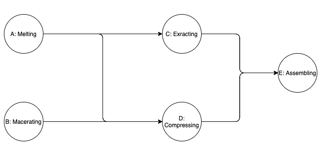

# thread-synchronization-java

## Quickstart

```
git clone git@github.com:simonpicard/thread-synchronization-java.git
cd thread-synchronization-java
cd src
make
java main
make clean
```

## Introduction

A toy project to learn about thread synchronization in java.

The project simulates a manufacturing process where different worker must process different articles on different workstation.
Constraint:
- Each workstation performs as single type of action on the article
- A workstation can be used by a single worker on a single article at a time
- Artcile must be transformed in each workstation in a given order represented by a graph

## Example simulation
### Scenario

Three workers must process two articles following this below flow:




- Workers 1. and 2. are processing together article 1.
- Worker 3. is processing the article 2.

### Output

```
Melting the article 0
Macerating the article 0
Melting the article 1
Extracting the article 0
Macerating the article 1
Extracting the article 1
Compressing the article 0
Compressing the article 1
Assembling the article 0
Assembling the article 1
Melting the article 2
Macerating the article 2
Extracting the article 2
Compressing the article 2
Assembling the article 2
###########

Worker 0 :
Article 0 skipped Workstation A
Article 0 skipped Workstation B
Article 1 processed on Workstation A
Article 1 processed on Workstation B
Article 1 processed on Workstation C
Article 1 processed on Workstation D
Article 1 processed on Workstation E

Worker 1 :
Article 0 processed on Workstation A
Article 0 processed on Workstation B
Article 0 processed on Workstation C
Article 0 processed on Workstation D
Article 0 processed on Workstation E
Article 1 skipped Workstation A
Article 1 skipped Workstation B

Worker 2 :
Waited for the Workstation A to be ready for the article 2
Article 2 processed on Workstation A
Article 2 processed on Workstation B
Article 2 processed on Workstation C
Article 2 processed on Workstation D
Article 2 processed on Workstation E

###########

Article 0 :
Worker 1 processed Workstation A
Worker 0 skipped Workstation A
Worker 1 processed Workstation B
Worker 0 skipped Workstation B
Worker 1 processed Workstation C
Worker 1 processed Workstation D
Worker 1 processed Workstation E

Article 1 :
Worker 0 processed Workstation A
Worker 0 processed Workstation B
Worker 0 processed Workstation C
Worker 0 processed Workstation D
Worker 1 skipped Workstation A
Worker 1 skipped Workstation B
Worker 0 processed Workstation E

Article 2 :
Worker 2 processed Workstation A
Worker 2 processed Workstation B
Worker 2 processed Workstation C
Worker 2 processed Workstation D
Worker 2 processed Workstation E
```
